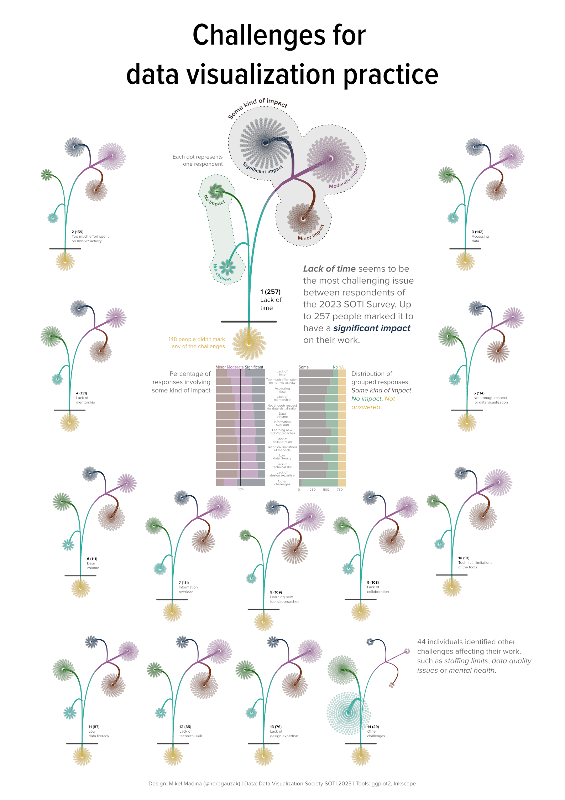

# public-data-visualisations

### [2024ko Eusko Legebiltzarrerako Hauteskundeak](https://github.com/mikelmadina/public-data-visualisations/tree/main/2024-04-22-EAE_Hauteskundeak)

### [DVS SOTI 2023 Challenge](https://github.com/mikelmadina/public-data-visualisations/tree/main/2024-03-DVS-survey)

### [EAEko lurralde eremuen biztanleria piramideak (2001-2023)](https://github.com/mikelmadina/public-data-visualisations/tree/main/2024-01_Piramideak)

### [EAEko biztanleriaren adinaren bilakaera 2001-2023](https://github.com/mikelmadina/public-data-visualisations/tree/main/2023-11_Populazioa)

### [Eurovisión 2023](https://github.com/mikelmadina/public-data-visualisations/tree/main/2023-05_Eurovision)

Composición final con Inkscape

Hasta aquí llegué con ggplot2/patchwork

